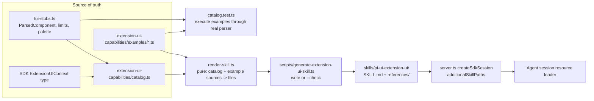

# Plan: generated `pi-ui-extension-ui` skill

Status: implemented

## 1. Goal

Agents running inside Pi UI should know, while they write a Pi extension, how each extension UI
call will actually appear in Pi UI. Deliver this as a Pi skill that:

1. is discovered automatically by every Pi UI session (no manual install, no files written into
   `~/.pi` or the user's project);
2. derives its capability reference from code, so it cannot silently drift from the renderer;
3. ships executable examples that are verified against the real parser.

### Non-goals

- Live preview or render-a-draft tool (possible follow-up; see §11).
- Changing how any extension UI renders. This plan documents current behavior; if documenting a
  behavior shows it is wrong, fix that separately.
- Documenting the general Pi extension API. The skill covers the UI surface and how Pi UI presents
  it, and points to upstream docs for everything else.

## 2. Findings that shape the design

| Fact                                                                                                                                                                                                                                                                                                                                                                                                | Evidence                                                                              | Consequence                                                                                                                                     |
| --------------------------------------------------------------------------------------------------------------------------------------------------------------------------------------------------------------------------------------------------------------------------------------------------------------------------------------------------------------------------------------------------- | ------------------------------------------------------------------------------------- | ----------------------------------------------------------------------------------------------------------------------------------------------- |
| The SDK accepts extra skill directories through `createAgentSessionServices({ resourceLoaderOptions: { additionalSkillPaths } })`.                                                                                                                                                                                                                                                                  | `pi-coding-agent/dist/core/agent-session-services.d.ts:34`, `resource-loader.d.ts:73` | Register the skill in the host. Do not install files into user directories.                                                                     |
| All normal session creation goes through `createSdkSession` (`server.ts:2573`). The `/clone` slash command calls `sdk.createAgentSession` directly, in two places.                                                                                                                                                                                                                                  | `server.ts:5082`, `server.ts:5092`                                                    | `/clone` would lose the skill. It also currently skips project-trust resolution and extension flag values. Route it through `createSdkSession`. |
| Skill names must match `^[a-z0-9-]+$` and be ≤64 characters. Descriptions are required and ≤1024 characters.                                                                                                                                                                                                                                                                                        | `pi-coding-agent/dist/core/skills.js:9-89`                                            | The generator validates its own frontmatter against these limits.                                                                               |
| `ParsedComponent` is a closed union with 11 kinds.                                                                                                                                                                                                                                                                                                                                                  | `src/lib/tui-stubs.ts:610`                                                            | Key the catalog by `ParsedComponent['kind']` so TypeScript enforces exhaustiveness.                                                             |
| The parser is duck-typed. `select`, `settings`, `input` (from `Input`/`Editor`), `loader`, `markdown`, `text`, `image`, and `container` (from `Box`/`HStack`/`VStack`) are produced by real pi-tui exports. `button`, `checkbox`, and `progress` are produced only by **Pi UI-specific object shapes** (`{label, onClick}`, `{checked, onToggle}`, `{progress, render}`) that have no pi-tui class. | `tui-stubs.ts:793-935`, `pi-tui/dist/index.d.ts`                                      | The skill must document those three shapes explicitly as Pi UI conventions. In the terminal TUI they render only through their own `render()`.  |
| `custom()` first tries static parsing, which gives a native rich dialog that is re-parsed every 200 ms and runs real callbacks. It uses terminal emulation only when the root has `handleInput` and parsing produces empty or render-fallback text.                                                                                                                                                 | `server.ts:1259-1395`, `shouldUseInteractiveCustom` (`tui-stubs.ts:1107`)             | This decision rule is the most important thing the skill can teach, and it can be tested.                                                       |
| `setHeader` and `setFooter` factories are parsed, then **flattened to plain text** before they are sent to the browser.                                                                                                                                                                                                                                                                             | `server.ts:1596-1653` (`flattenParsedText`)                                           | Mark both as degraded: rich components lose their structure there.                                                                              |
| `setWidget` accepts `string[]`, rendered as text lines with ANSI colors converted to styled HTML, or a factory that is parsed and re-ticked every 250 ms while its session is active. Placement is `aboveEditor` or `belowEditor`.                                                                                                                                                                  | `server.ts:1536-1594`                                                                 | Document both forms and the refresh cadence.                                                                                                    |
| The protocol declares `table` and `badge` widget types, but no server code produces them.                                                                                                                                                                                                                                                                                                           | `protocol.ts:246-256`; there are no producers in `server.ts` or `src/lib/server`      | Do not document them. Report the unused types separately; do not remove them in this change.                                                    |
| `select`/`confirm`/`input` ignore `opts` (`timeout`, `signal`). `setTheme` is a no-op that returns success; `getAllThemes` returns `[]`; `getTheme` returns the stub theme.                                                                                                                                                                                                                         | `server.ts:1175-1214`, `server.ts:1734-1743`                                          | The catalog needs `degraded` and `ignored` support levels in addition to `native`.                                                              |
| Theme colors map to Pi UI's own palette. Unknown color names fall back to base text.                                                                                                                                                                                                                                                                                                                | `FG_PALETTE`, `tui-stubs.ts:181`                                                      | The generated reference lists the supported semantic color names from the palette keys.                                                         |
| Wire limits are exported constants: aux total 256 KB and images 256 KB. Node, item, and depth caps (256/256/128) are module-private.                                                                                                                                                                                                                                                                | `wire-limits.ts`, `tui-stubs.ts:623-626`                                              | Export the three private caps so the generated limits section reads them from code instead of copying numbers.                                  |
| Vitest already builds real pi-tui components and runs them through `parseComponentTree`.                                                                                                                                                                                                                                                                                                            | `src/lib/__tests__/tui-stubs.test.ts:550-700`                                         | Executable examples fit the existing test setup without new infrastructure.                                                                     |
| `APP_ROOT` is `dirname(import.meta.url)` of `server.ts` or `server.bundle.js`, both at the package root.                                                                                                                                                                                                                                                                                            | `server.ts:163`, `bin/pifrontier.ts:277-284`                                          | `join(APP_ROOT, 'skills', …)` resolves both in a checkout and in an installed package, as long as `skills/` is added to `package.json#files`.   |

## 3. Architecture



### File layout

```
src/lib/extension-ui-capabilities/        # "shared" boundary element (pure TS, no DOM/server deps)
  catalog.ts                              # typed capability data
  render-skill.ts                         # pure renderer: (catalog, exampleSources) => GeneratedFile[]
  examples/
    select-dialog.ts                      # one file per example; region markers delimit the published source
    rich-custom-dialog.ts
    live-progress-widget.ts
    keyboard-driven-overlay.ts
    ...
  __tests__/
    catalog.test.ts
scripts/
  generate-extension-ui-skill.ts          # IO shell: read example files, call renderer, write or --check
skills/pi-ui-extension-ui/                # GENERATED, committed, shipped in the package
  SKILL.md
  references/
    ui-methods.md
    components.md
    examples.md
```

Boundary notes:

- `src/lib/extension-ui-capabilities/**` matches the `shared` element (`eslint.config.js:96`), so both
  `scripts/**` (`server`) and tests can import it. It must not import `src/lib/server/**` or anything
  that touches the DOM.
- Keep `catalog.ts` data-only apart from type imports. It may import constants and types from
  `tui-stubs.ts` and `wire-limits.ts`, and **types only** from `@earendil-works/pi-coding-agent` and
  `@earendil-works/pi-tui`.
- `render-skill.ts` is a pure function with no `fs`, clock, or environment access. All IO lives in the
  script. This makes the generator deterministic and testable without touching the filesystem.

## 4. The catalog (`catalog.ts`)

Three typed tables and one limits object. Every table uses `satisfies` so exhaustiveness comes from
the compiler, not from a test.

```ts
import type { ExtensionUIContext } from '@earendil-works/pi-coding-agent';
import type * as PiTui from '@earendil-works/pi-tui';
import type { ParsedComponent } from '#lib/tui-stubs.js';

/** Where a capability appears in Pi UI. Closed set; the renderer maps each to prose. */
export type Surface =
  | 'modal-dialog' // select/confirm/input/editor
  | 'rich-dialog' // custom(), statically parsed
  | 'terminal-overlay' // custom(), keyboard-driven fallback
  | 'widget' // setWidget, above/below the composer
  | 'header'
  | 'footer'
  | 'status-bar'
  | 'toast'
  | 'composer'
  | 'document-title'
  | 'working-indicator'
  | 'thinking-block';

export type Support =
  | { level: 'native'; surface: Surface }
  | { level: 'degraded'; surface: Surface; degradation: string }
  | { level: 'ignored'; behavior: string }; // accepted; no visible effect in Pi UI

export interface UiMethodCapability {
  support: Support;
  summary: string; // one sentence: what the user sees
  useWhen?: string;
  avoidWhen?: string;
  ignoredOptions?: readonly string[]; // e.g. ['timeout', 'signal']
}

/** Every member of the SDK UI context must be classified — SDK upgrades that add one fail typecheck. */
export const UI_METHODS = {
  select: {
    support: { level: 'native', surface: 'modal-dialog' },
    summary: '…',
    ignoredOptions: ['timeout', 'signal'],
  },
  setHeader: {
    support: {
      level: 'degraded',
      surface: 'header',
      degradation: 'Component trees are flattened to plain text.',
    },
    summary: '…',
  },
  setTheme: {
    support: {
      level: 'ignored',
      behavior: 'Returns { success: true } without changing appearance.',
    },
    summary: '…',
  },
  // …
} as const satisfies Record<keyof ExtensionUIContext, UiMethodCapability>;

/** How an author produces a parsed kind: a real pi-tui export, or a Pi UI duck-typed shape. */
export type ComponentSource =
  | { via: 'pi-tui'; exports: readonly (keyof typeof PiTui)[] }
  | { via: 'shape'; requiredFields: readonly string[]; optionalFields?: readonly string[] };

export interface ComponentCapability {
  sources: readonly ComponentSource[];
  rendersAs: string; // what the browser shows
  interaction: 'none' | 'select' | 'submit' | 'toggle' | 'click' | 'cycle';
  notes?: readonly string[]; // e.g. "single-child containers collapse to the child"
  example: ExampleId; // must reference an example that produces this kind
}

export const COMPONENTS = {
  select: {
    sources: [{ via: 'pi-tui', exports: ['SelectList'] }],
    interaction: 'select' /* … */,
  },
  button: {
    sources: [
      { via: 'shape', requiredFields: ['label', 'onClick'], optionalFields: ['variant'] },
    ] /* … */,
  },
  // …
} as const satisfies Record<ParsedComponent['kind'], ComponentCapability>;

/** Every pi-tui runtime component export must be classified (enforced by test, see §7). */
export const PI_TUI_EXPORTS = {
  TruncatedText: {
    parsesAs: 'text',
    note: 'Rendered through render(); shown as preformatted text.',
  },
  ScrollView: { parsesAs: 'terminal-fallback', note: '…' },
  // …
} satisfies Partial<
  Record<
    keyof typeof PiTui,
    { parsesAs: ParsedComponent['kind'] | 'terminal-fallback' | 'dropped'; note: string }
  >
>;

export const LIMITS = {
  maxNodes: MAX_PARSED_COMPONENT_NODES,
  maxItemsPerNode: MAX_PARSED_COMPONENT_ITEMS,
  maxDepth: MAX_COMPONENT_TREE_DEPTH,
  maxTreeChars: MAX_WIRE_AUX_TOTAL_CHARS,
  maxImageChars: MAX_WIRE_IMAGE_CHARS,
  widgetRefreshMs: WIDGET_TICK_MS,
  customRefreshMs: CUSTOM_REPARSE_MS,
} as const;

export const THEME_COLORS = Object.keys(FG_PALETTE) as readonly string[];
```

Rules for catalog content:

- **Describe observable behavior, not implementation.** Say what the user sees and how it responds
  to input, not which function runs or which message type is sent.
- **Every claim must be backed by code or a test.** Every `support.level` must be justified by the
  server implementation. Every component claim must be backed by a verified example.
- **Keep guidance short and decision-oriented.** `useWhen`/`avoidWhen` are one sentence each. Any
  longer explanation belongs in the authored sections of `render-skill.ts`, not in the data.
- **Take numbers from code.** Import every numeric limit from the code that enforces it. The two
  refresh intervals (`250` in `setWidget`, `200` in `custom`) are currently inline literals in
  `server.ts`; hoist them into named exports in `tui-stubs.ts` (or a small shared module) and use
  those constants at both the enforcement and documentation sites.

## 5. Executable examples (`examples/*.ts`)

Each example is a real TypeScript module that does two jobs: it is executed by tests, and its
published region is copied verbatim into the skill.

```ts
// examples/select-dialog.ts
import { SelectList } from '@earendil-works/pi-tui';
import type { ExampleModule } from '../catalog.ts';

export const example = {
  id: 'select-dialog',
  title: 'Let the user pick one option with descriptions',
  surface: 'rich-dialog',
  expectedKind: 'select',
  factory: (_tui, theme, _keybindings, done) => {
    // #region published
    const list = new SelectList(
      [
        { value: 'fast', label: 'Fast', description: 'Lower quality, cheap' },
        { value: 'thorough', label: 'Thorough', description: 'Slower, more careful' },
      ],
      8,
      theme.selectList
    );
    list.onSelect = (item) => done(item.value);
    return list;
    // #endregion published
  },
} satisfies ExampleModule;
```

- `ExampleModule` has the shape `{ id, title, surface, expectedKind | 'terminal-fallback', factory }`.
  `ExampleId` is the union of registered ids, so `COMPONENTS[*].example` cannot refer to a missing
  example.
- The generator extracts the `// #region published` block, dedents it, and wraps it in the
  `ctx.ui.custom(...)`, `ctx.ui.setWidget(...)`, or similar call that matches `surface`. The published
  snippet is therefore real, type-checked source.
- Required example set:
  - one example per `ParsedComponent` kind, including the three shape-only kinds;
  - one keyboard-driven `custom()` example that is expected to use the terminal fallback;
  - one live-updating widget factory;
  - one example of `HStack` layout.
- Include the examples in the `check:server` TypeScript project, or confirm that `svelte-check`
  already covers them, so a broken example fails typechecking.

## 6. Generated skill content

`render-skill.ts` returns `GeneratedFile[]` (`{ path, content }`) in a fixed order. `SKILL.md` stays
short, around 150 lines, because it is loaded into the context. Detail goes into `references/`, which
the agent reads only when needed.

**`SKILL.md`**

- Frontmatter:
  - `name: pi-ui-extension-ui`;
  - a `description` that states the trigger clearly: “Use when writing or modifying a Pi extension
    that calls `ctx.ui` (dialogs, widgets, custom components, status, header/footer) and you need to
    know how it will render in Pi UI.” The generator asserts the SDK limits.
- Generated-file banner: `<!-- GENERATED by scripts/generate-extension-ui-skill.ts — do not edit -->`.
- Authored sections, held as template constants in `render-skill.ts`:
  1. **Mental model.** Pi UI runs the extension's pi-tui factories on the server, converts supported
     components into native web controls, and uses a terminal emulator only for keyboard-driven UI.
  2. **Choosing a mechanism.** A generated decision table from `UI_METHODS.useWhen`/`avoidWhen`.
  3. **Rules for good Pi UI rendering.** Prefer the parsable pi-tui components; wire callbacks such as
     `onSelect`, `onSubmit`, `onClick`, and `onToggle` instead of raw keys where possible; keep headers
     and footers as text; design for narrow and mobile widths; mutate live state instead of
     re-prompting.
  4. **Portability.** The same extension must also work in the terminal TUI. Shape-only kinds render
     natively only in Pi UI, so give them a sensible `render()`.
  5. **Support at a glance.** A generated table with one row per `UI_METHODS` entry: method, support
     level, and surface.
  6. **Where to read more.** Links to `references/*`.

**`references/ui-methods.md`**: every method with its support level, degradation or ignored behavior,
and ignored options.

**`references/components.md`**: every kind with its sources (pi-tui export or exact shape fields),
rendered form, interaction, and notes; the `PI_TUI_EXPORTS` coverage table; `THEME_COLORS`; and
`LIMITS`.

**`references/examples.md`**: every example's title, surface, and published snippet.

Renderer requirements:

- Output must be deterministic. Iterate tables in declaration order and include no timestamps,
  absolute paths, or version strings that change between runs.
- Escape table cells with one `mdCell()` helper for pipes and newlines. Do not format Markdown ad hoc
  in several places.
- Run Prettier's Markdown formatting in the script, not in the renderer, so committed output matches
  `bun run format` and the `--check` comparison stays byte-exact.

## 7. Verification (tests that guard real contracts)

`src/lib/extension-ui-capabilities/__tests__/catalog.test.ts` (Vitest):

1. **Examples render as documented.** For each example, run `factory` with `StubTui`, the stub
   theme, and stub keybindings; parse it with `parseComponentTree` plus `boundParsedComponentTree`;
   then apply `shouldUseInteractiveCustom`. Assert that the root, or its first meaningful node, has
   `expectedKind`, or that the fallback decision matches `terminal-fallback`. This fails when a parser
   change makes the documentation false.
2. **Every catalog kind has an example of that kind.** For each `COMPONENTS[kind].example`, the
   referenced example's `expectedKind` equals `kind`. The type system proves that the id exists; this
   test proves the example actually demonstrates that kind.
3. **pi-tui export coverage.** Enumerate the runtime exports of `@earendil-works/pi-tui` whose
   prototype has `render`, and assert that each is in `COMPONENTS[*].sources` or `PI_TUI_EXPORTS`. A
   pi-tui upgrade that adds a component fails until someone classifies it.
4. **Frontmatter validity.** The generated `SKILL.md` frontmatter satisfies the SDK name and
   description rules. Prefer calling the SDK's skill loader on a temporary directory over copying its
   regex.

Do **not** add tests that pin rendered Markdown text, table layout, or wording.

Freshness check: `bun scripts/generate-extension-ui-skill.ts --check` exits non-zero and prints the
stale path when the committed output differs. Add `generate:skill` and `check:skill` scripts, and add
`check:skill` to `test:ci` next to `check:server`.

Discovery smoke check, run once for this PR:

- Start `bun run dev:ws` and connect.
- Send `get_resources` and confirm `resources_list.skills` contains `pi-ui-extension-ui`.
- Run `/clone` and confirm the cloned session also lists it.
- Repeat with `bun run build:server && bun bin/pifrontier.ts` from a non-git copy, or with
  `npm pack` contents, to prove the bundled path resolves.

If the live E2E suite already starts a real server with the resource loader active, add one assertion
there that the skill is listed. Bundled path resolution is the plausible regression this guards, and
nothing else covers it.

## 8. Host integration (`server.ts`)

1. Add a small helper in `src/lib/server/`, for example `bundled-resources.ts`:

   ```ts
   export function bundledSkillPaths(appRoot: string): string[] {
     const dir = join(appRoot, 'skills', 'pi-ui-extension-ui');
     return existsSync(join(dir, 'SKILL.md')) ? [dir] : [];
   }
   ```

   The existence check makes a missing package directory a no-op instead of an SDK diagnostic on every
   session. Log once at startup if it is missing.

2. In `createSdkSession`, pass
   `resourceLoaderOptions: { additionalSkillPaths: bundledSkillPaths(APP_ROOT) }`. Compute the list
   once at module load, not for every session.
3. Change both `/clone` call sites (`server.ts:5082`, `server.ts:5092`) to use `createSdkSession`
   with the appropriate `SessionStartEvent` reason. That gives cloned sessions the skill, project
   trust, and extension flags. Check the handling of `session.model`: `createSdkSession` does not take
   a model, so either set it after creation (`session.setModel`) or add an optional parameter. Pick
   whichever mirrors how `fork_session` preserves the model today.
4. Add `"skills/"` to `package.json#files`.
5. Add a one-line comment above `ServerExtensionUIContext` (`server.ts:1065`) and at the top of
   `extension-component.svelte`: “Behavior changes here must be reflected in
   `src/lib/extension-ui-capabilities/catalog.ts`; then run `bun run generate:skill`.” That is the
   only reminder for renderer and server behavior the compiler cannot see.

## 9. Work breakdown

Each step leaves the tree green. Steps 2 and 3 can proceed in parallel once step 1 has landed.

| #   | Step                                                                                                                                                                                                                                                            | Acceptance                                                                                      |
| --- | --------------------------------------------------------------------------------------------------------------------------------------------------------------------------------------------------------------------------------------------------------------- | ----------------------------------------------------------------------------------------------- |
| 1   | Export the parser caps (`MAX_PARSED_COMPONENT_NODES`/`ITEMS`, `MAX_COMPONENT_TREE_DEPTH`) and hoist the widget and custom refresh intervals into named constants used by `server.ts`. No behavior change.                                                       | `check:server` passes; existing `tui-stubs` tests pass unchanged.                               |
| 2   | Add `catalog.ts` types and full data for `UI_METHODS`, `COMPONENTS`, `PI_TUI_EXPORTS`, `LIMITS`, and `THEME_COLORS`. Justify each `support` level from the §2 evidence; read the remaining `uiContext` members (`server.ts:1174-1757`) before classifying them. | Typecheck passes; removing any entry fails compilation.                                         |
| 3   | Add the `examples/` set required by §5 and `catalog.test.ts` tests 1–3.                                                                                                                                                                                         | Tests pass. Deliberately changing an example's `expectedKind` makes test 1 fail.                |
| 4   | Add `render-skill.ts`, the generator script with `--check`, `generate:skill`/`check:skill` scripts, test 4, and the initial committed `skills/pi-ui-extension-ui/`.                                                                                             | Running the generator twice is a no-op; hand-editing a generated file makes `check:skill` fail. |
| 5   | Add host integration (§8): helper, `createSdkSession` wiring, `/clone` cutover, `files` entry, and reminder comments.                                                                                                                                           | Discovery smoke checks in §7 pass for a checkout, `/clone`, and the bundle.                     |
| 6   | Update docs: add `extension-ui-capabilities/` and `skills/` to `AGENTS.md` Key Directories and commands; add a short “Bundled skill” note in `docs/architecture.md` near the `CustomEntry` renderer section; add a `CHANGELOG` entry if the repo keeps one.     | Docs name the regeneration command and the source of truth.                                     |

## 10. Code quality guidance

- **Keep one source of truth for each fact.** A number, color name, component kind, or method name
  appears in exactly one TypeScript location and flows to the skill from there. If a fact cannot be
  derived from code, it lives in `catalog.ts` and nowhere else.
- **Use compiler exhaustiveness before tests.** Use `satisfies Record<Union, …>` whenever a union
  exists. Reach for runtime enumeration only when the set exists only at runtime, as with pi-tui
  exports.
- **Keep the core pure and the IO at the edge.** The catalog is data, the renderer is a pure
  function, and filesystem access happens in the script. Tests never write into the repository.
- **Do not add a second parser or renderer.** Examples are verified with the production
  `parseComponentTree`, `boundParsedComponentTree`, and `shouldUseInteractiveCustom`. If a test needs
  more stub infrastructure, add it to `tui-stubs.ts` instead of forking it.
- **Treat generated output as committed build output.** Never hand-edit it, lint it, or format it
  separately. The script is the only writer.
- **Document the truth, then fix separately.** If writing the catalog reveals a bad behavior, such as
  ignored dialog timeouts or unused `table`/`badge` types, document the current behavior accurately
  and file the fix separately. Do not expand this PR to include it.
- **Keep scope tight.** Add no new WebSocket messages, runtime tools, UI panels, or settings toggles.

## 11. Risks and follow-ups

- **Server behavior drift the compiler cannot see.** A method's support level could change in
  `server.ts` without anyone updating the catalog. Mitigations: the reminder comments and
  example-backed tests for everything that goes through the parser. Accept residual risk for
  non-parser methods such as notify and status.
- **Context cost.** The `SKILL.md` body is loaded only when the skill is invoked. Keep it short and
  put exhaustive tables in `references/`.
- **Name collision.** A user skill named `pi-ui-extension-ui` would conflict. Its distinctive prefix
  makes that unlikely; the SDK reports collisions as diagnostics, which are already shown in the
  extensions panel.
- **Follow-up (not this PR): render preview.** A preview route or tool could render an example's
  `ParsedComponent` through `extension-component.svelte` at desktop and mobile widths. The catalog's
  examples would then become a visual gallery and a Playwright fixture at no extra authoring cost.
- **Follow-up (not this PR): honor dialog `timeout`/`signal`**, and either implement or remove the
  `table`/`badge` widget types.
